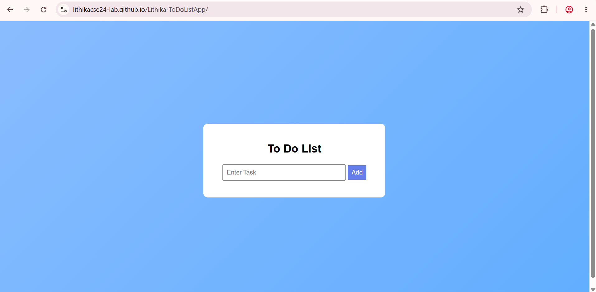
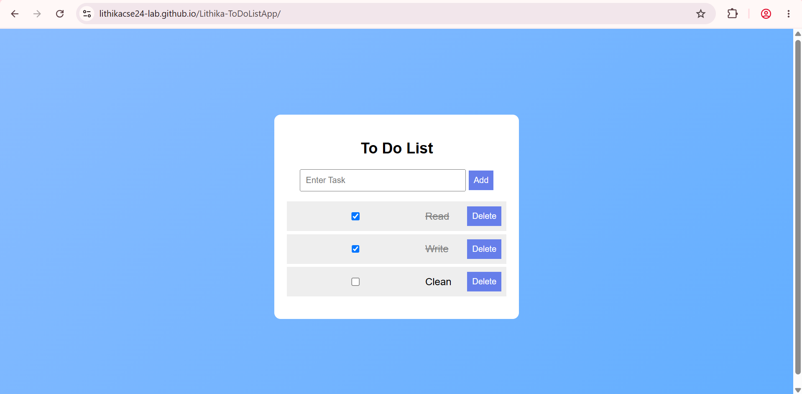
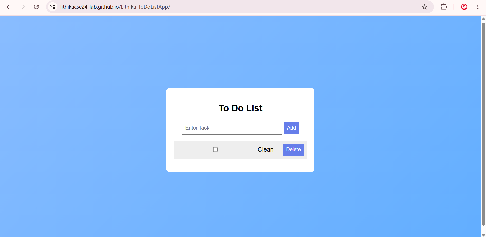

# 📝 To-Do List Web App

- A simple, responsive, and user-friendly To-Do List web application built using HTML, CSS, and JavaScript. 
- This project helps users organize and manage their daily tasks efficiently by providing features to add, complete, and delete tasks.

## 🌐 Live Demo
🔗 **Website:** https://lithikacse24-lab.github.io/Lithika-ToDoListApp/
>Deployment : Hosted using **Github Pages**

## 🚀 Features
- ➕ Add new tasks
- ✔️ Mark tasks as completed
- 🗑️ Delete individual tasks
- 📱 Responsive design for mobile and desktop devices
- ⚡ Simple and intuitive user interface

## 🛠️ Technologies Used
- **HTML5** – Provides the structure of the application
- **CSS3** – Handles styling, layout, and responsiveness
- **JavaScript** – Implements functionality and interactivity

## 📂 Folder Structure
```
ToDoList/
|__ screenshots/
|   └── home.png
|   └── add-complete.png
|   └── delete.png
│── index.html
│── style.css
│── script.js
└── README.md
```

## 📸 Screenshots
### 🏠 Home Screen

### ➕✔️ Add & Complete Task

### 🗑️ Delete Task


**⭐ If you found this project useful, please consider giving it a star on GitHub !**
